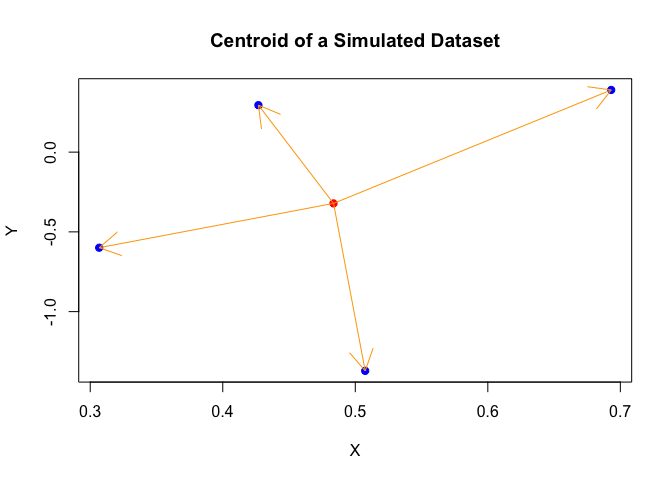
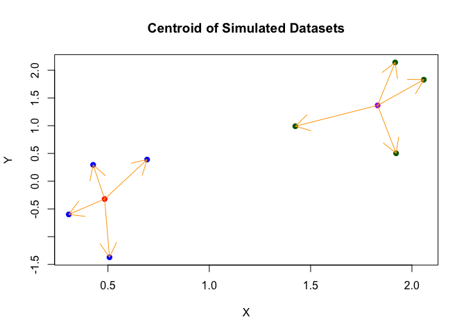
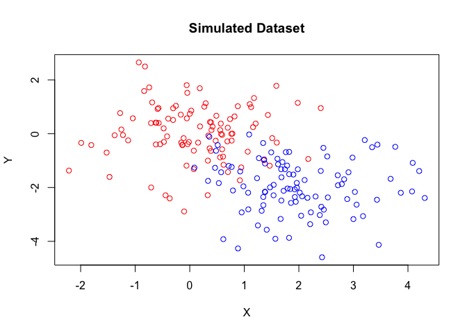
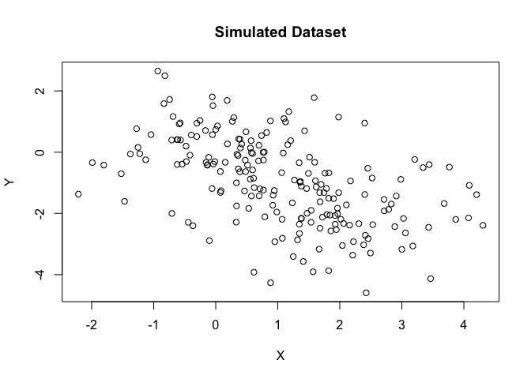
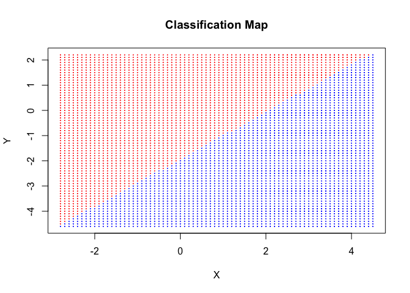
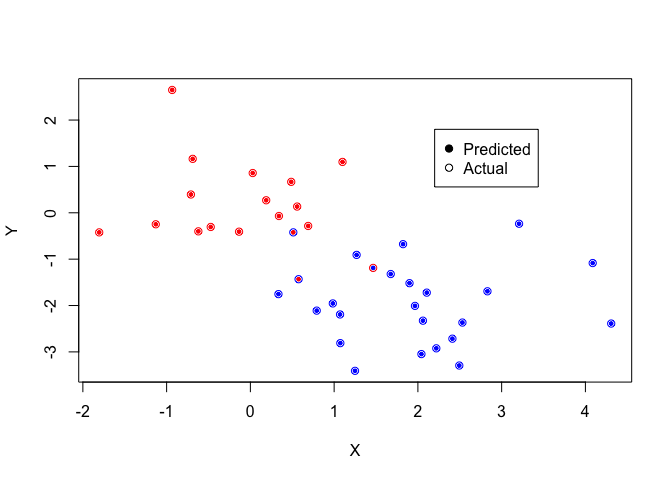

In a previous repository, I tried my hand at explaining the k-Nearest Neighbours algorithm for classifying points. In this tutorial, we will shortly cover another method of classification: nearest centroid classification.

The first thing we should cover is what a **centroid** is. A **centroid** simply put is the multivariate extension of the mean, it is the mean of the points in each dimension, which is itself a point in roughly the 'middle' of the space.



This graph is a great example of the centroid of a dataset, but also of the pitfalls with centroids. The centroid is a multivariate mean, so like the standard mean, it is strongly sensitive to outliers. In order to get around this, we can use the median or a trimmed mean, both of which R provides (the median() function and the trim argument of the mean() function). You can see in the dataset above that there are three points close together and one further apart that in some sense 'drags' the centroid towards it. We can consider another case however:

``` r
UntrimmedMean <- mean(c(1, 2, 2, 3, 4, 12))

TrimmedMean <- mean(c(1, 2, 2, 3, 4, 12), trim = 1/6)

Median <- median(c(1, 2, 2, 3, 4, 12))

print(c("Untrimmed Mean" = UntrimmedMean, "1/6th Trimmed Mean" = TrimmedMean, "Median" = Median))
```

    ##     Untrimmed Mean 1/6th Trimmed Mean             Median 
    ##               4.00               2.75               2.50

``` r
print(c("Is the Median the same as a 50% trimmed mean?" = (Median == mean(c(1, 2, 2, 3, 4, 12), trim = 1/2))))
```

    ## Is the Median the same as a 50% trimmed mean? 
    ##                                          TRUE

This is a good start, but for now we don't need to worry about these details. Centroids are very sensitive to outliers, and other measures of central tendencies of multivariate data might be less so (although they might suffer other deficiencies), and that is all we need to know. For our data, we will use centroids.

Now suppose instead of one group in my data, I have two:



This is how we arrive at nearest centroid classification. If we have another point in this picture, how far are you from each of the centroids? We may classify a new point based on which centroid it is closest to. We will demonstrate an example to classify novel points in that way.

So that's the idea, but an idea is not enough, we need to do it. Fortunately this shouldn't be particular difficult to code up, all we need to do is take in the data, find the average of each cluster, and then find the distance from each point we don't know to each cluster, then classifying it as the one it is closest to. There might be more efficient ways to do it, but this brute force method should be enough to start off with and especially on relatively small datasets.

I give an example of how to implement this process now:

``` r
nearestCentroidClassification <- function(data, classifications, unclassifiedPoint, p = c(1, 2, Inf)) {
  if (!is.factor(classifications)) { ## For the rest of this analysis, we'll use factors
    classifications <- as.factor(classifications)
  }
  Levels <- levels(classifications) ## Enumerate all the categories you can classify as
  nLevels <- length(Levels) ## How many categories are there? (could also use nlevels)
  diffCentroids <- data.frame(X = rep(NA, nLevels), Y = rep(NA, nLevels)) ## Pre-allocate memory
  for (i in 1:nLevels) { ## Get the centroid for each category by...
    subset <- data[as.character(classifications) == Levels[i], ] ## getting the group associated with a category,
    diffCentroids[i, ] <- colMeans(subset) ## and then take the mean in each dimension.
  }
  for (i in 1:length(unclassifiedPoint)) { ## For each dimension...
    diffCentroids[ , i] <- abs(diffCentroids[ , i] - unclassifiedPoint[i]) ## Find the absolute difference between that dimension of the centroid and that dimension of the unclassified point.
  }
  if (is.infinite(p)) { ## If p = Inf (i.e. you want to use the infinity norm)...
    pInfs <- apply(diffCentroids, 1, max, na.rm = TRUE) ## Take the maximum of the absolute differences for each centroid,
    return(Levels[which.min(pInfs)]) ## and return the level associated with the minimum distance.
  }
  else if (is.finite(p)) { ## If instead p is in the positive integers, 
    distances <- apply(diffCentroids, 1, function(x) sum(x^p)^(1/p)) ## Take the p-norm of the absolute differences with each centroid, 
    return(Levels[which.min(distances)]) ## and return the level associated with the minimum.
  }
  else { ## If you don't give a value for p, will return the euclidean norm.
    warning("No or invalid argument given for p, defaulting to l2/euclidean distances.")
    distances <- apply(diffCentroids, 1, function(x) sum(x^2)^(1/2))
    return(Levels[which.min(distances)])
  }
}
```

This function accounts for another feature we don't have by default: our choice of distance measure. This is a question that is not intuitively obvious, but it is significant because there are multiple ways to meausure difference and they're not all created equal. For this function, I implemented the p-norm family of distances which go for every positive integer as well as infinity, there are some distances that are more significant than others, such as the l1/taxicab norm, l2/euclidean norm, and the infinity norm. The choice of distance measure is another essential conceptual question during the implementatio of algorithms like the nearest centroid classifier.

To really see this method at work, let's use a larger simulated dataset.

``` r
set.seed(1)

simulatedData <- data.frame(X = c(rnorm(100), rnorm(100, mean = 2)), Y = c(rnorm(100), rnorm(100, mean = -2)))

classifications <- c(rep("red", 100), rep("blue", 100))

plot(simulatedData, col = classifications, main = "Simulated Dataset")
```



This opportunity will show another potential pitfall of nearest centroid techniques: in this case, the datasets are far more overlapping to the points that if we leave the colour out...



You could be led to suspect it is in fact a single cluster. In this case, we expect a lot more false classifications in the overlap. If I can find the time, in another tutorial I will try to show methods that can distinguish between one cluster and two (e.g. 'non-parametric' Bayesian methods), but for now we will just have to be satisfied that there is some such method.

However let's see what happens when we take a point (1, -1.2) and try to classify it using a Euclidean distance measure (because we feel like it, we have not checked that assumption for accuracy):

``` r
classificationOfNewPoint <- nearestCentroidClassification(simulatedData, as.factor(classifications), unclassifiedPoint = c(1, -1.2), p = 2)

cat(classificationOfNewPoint)
```

    ## blue

There you go, it works. Now let's try to make a classification map using a procedure I used in our previous k-nearest neighbours tutorial:

``` r
Xs = seq(-2.8, 4.5, by = 0.1)
Ys = seq(-4.6, 2.2, by = 0.1)

resultMatrix <- matrix(nrow = length(Xs)*length(Ys), ncol = 2)
pixelColour <- rep(NA, length(Xs)*length(Ys))

i <- 1

for (x in Xs) {
  for (y in Ys) {
    resultMatrix[i, ] <- c(x, y)
    pixelColour[i] <- nearestCentroidClassification(simulatedData, as.factor(classifications), unclassifiedPoint = c(x, y), p = 2)
    i <- i+1
  }
}

rm(i, x, y)

plot(x = resultMatrix[ , 1], y = resultMatrix[ , 2], col = pixelColour, cex = 0.1, xlab = "X", ylab = "Y", main = "Classification Map")
```



We can also take some of our data and set it aside as a testing sample, then see how good the nearest centroid method is at predicting the classification of that data when we use the rest of the data, the training data.

``` r
testIndex <- sample(1:200, size = 40)

testData <- simulatedData[testIndex, ]
testClassification <- classifications[testIndex]

trainingData <- simulatedData[-testIndex, ]
trainingClassification <- classifications[-testIndex]

predictedClassification <- rep(NA, 40)

for (i in 1:40) {
  predictedClassification[i] <- nearestCentroidClassification(trainingData, as.factor(trainingClassification), unclassifiedPoint = unlist(testData[i, ]), p = 2)
}

proportionCorrect <- mean(testClassification == predictedClassification)

plot(x = c(testData[ , 1], testData[ , 1]), y = c(testData[ , 2], testData[ , 2]), col = c(predictedClassification, testClassification), cex = c(rep(0.5, 40), rep(1, 40)), pch = c(rep(19, 40), rep(1, 40)), xlab = "X", ylab = "Y")

legend(x = 2.2, y = 1.8, legend = c("Predicted", "Actual"), pch = c(19, 1))
```



    ## Proportion Correct 
    ##              0.925

Here, the fill represents the predicted classification, and the outline represents the actual classification. We see that in fact we had a 90% correct prediction rate, which is pretty good for starters. Like with previous tutorials I'll try to fit in another one that does a benchmark with an established function and another that does geometric morphometrics on the data.
